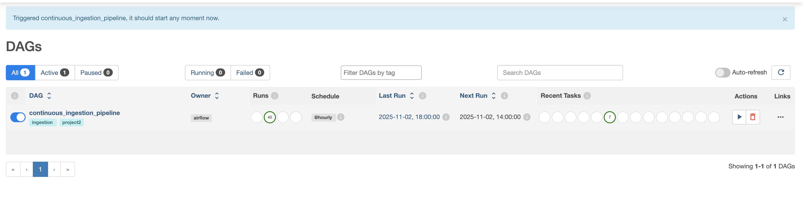
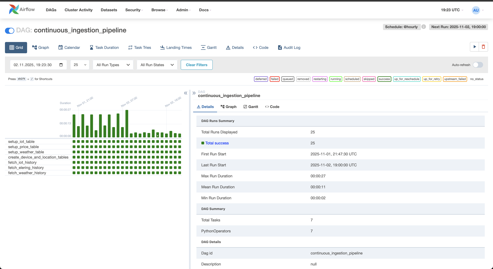
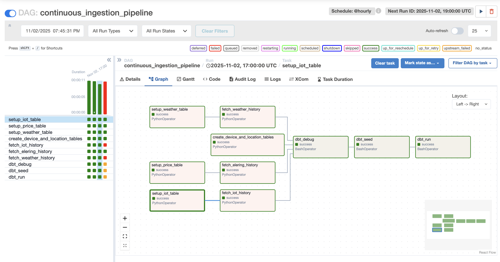

# ⚙️ Part 2 — Data Pipeline with Airflow, dbt, and ClickHouse

This stage extends the project into a **fully automated data engineering pipeline**, integrating **Airflow**, **dbt**, and **ClickHouse**.  
The goal is to orchestrate data ingestion, transformation, and storage for the analytical data warehouse designed in Part 1.

---

## Overview - how to run the project (setup instructions, environment variables, dependencies)


1. **Install [Tailscale](https://tailscale.com/)**: Sign in to Tailscale with the Google account or invite link provided by the team.
2. **Obtain secrets**: Get the shared `.env.local` file from the team. Place it alongside `docker-compose.yml` inside `02_Airflow_ClickHouse_dbt/` before starting any containers.
The file can be found from [Google Drive](https://drive.google.com/file/d/1_C8yHceYJq4tOPXwc69b1QlV-fdz3qt6/view?usp=sharing) and is directly available to course lectors. The peer graders and other interested parties must request access and **provide well explained reason** to obtain the access.
3. **Clone or update the project**:
  - Fresh setup: `git clone https://github.com/LauriLopp/DE_project_2025.git`
  - Existing clone: `git pull` to fetch the latest changes.
4. **Change directory**: `cd DE_project_2025/02_Airflow_ClickHouse_dbt`
5. **Start the stack**: `docker compose up --build -d`
6. **Access Airflow**: open `http://localhost:8080`, log in with username `airflow` and password `airflow`.
7. **Enable the pipeline**: turn on the `continuous_ingestion_pipeline` DAG and confirm the tasks progress to running state.
8. **Access CloudBeaver UI**: open `http://localhost:8978`, click the gear icon (top right), log in with `cbadmin / CloudBeaver1`.
9. **Create ClickHouse connection**:
  - Click `+ New connection` → `ClickHouse`.
  - Host `clickhouse-server`, Database `default`, Username `airflow`, Password `supersecret`.
  - Optionally tick “Save credentials for all users with access”, then click **Test** → **Create**.
10. **Verify data**: browse the ClickHouse connection; the `default` schema should list the bronze, staging, dimensional, and fact tables produced by the DAG.

---

## 📁 Project Structure

```
02_Airflow_ClickHouse_dbt/
├── .env.local                          # (User-provided) Contains secret tokens and credentials
├── clickhouse-init/                    # Scripts to initialize ClickHouse on first run
├── cloudbeaver-init/                   # Pre-configured connection settings for CloudBeaver UI
├── config/                             # ClickHouse user and profile configurations
├── dags/
│   └── home_assistant_continuous_raw.py  # The main Airflow DAG orchestrating the pipeline
├── data/                                 # Mounted volume for data exchange (not used in final version)
├── dbt/
│   ├── logs/                           # (Generated) dbt run and debug logs
│   ├── macros/
│   │   └── expression_is_true_clickhouse.sql # Custom generic test for ClickHouse
│   ├── models/
│   │   ├── marts/                      # Gold layer: Dimensional and fact models
│   │   │   ├── dim_device.sql
│   │   │   ├── dim_location.sql
│   │   │   ├── dim_time.sql
│   │   │   ├── fact_heating_energy_usage.sql
│   │   │   └── schema.yml              # Defines tests and descriptions for the mart layer
│   │   ├── staging/                    # Silver layer: Cleaned and standardized views
│   │   │   ├── stg_device.sql
│   │   │   ├── stg_iot_data.sql
│   │   │   ├── stg_location.sql
│   │   │   ├── stg_price_data.sql
│   │   │   └── stg_weather_data.sql
│   │   └── sources.yml                 # Defines Bronze layer sources for dbt
│   ├── seeds/
│   │   └── estonian_holidays.csv       # Seed data for public holidays
│   ├── .user.yml                       # (Generated) dbt user configuration
│   ├── dbt_project.yml                 # Main dbt project configuration file
│   ├── package-lock.yml                # Lockfile for dbt package versions
│   ├── packages.yml                    # Declares external dbt package dependencies
│   ├── profiles.yml                    # Database connection profiles for dbt
│   └── selectors.yml                   # Definitions for selecting subsets of models
├── device_location_data/               # Static CSVs mounted into ClickHouse for seeding
│   ├── device_data.csv
│   └── location_data.csv
├── logs/                                 # (Generated) Airflow task logs
├── docker-compose.yml                  # Defines and configures all services (Airflow, dbt, ClickHouse, etc.)
├── Dockerfile                          # Docker build instructions for the standalone dbt service
├── Dockerfile.airflow                  # Docker build instructions for the Airflow services
├── README.md                           # This file: Main documentation for Part 2
├── continuous_ingestion_pipeline.png   # Screenshot of the Airflow DAG graph view
├── dag_details.png                     # Screenshot of the Airflow DAG details
├── dag_listing.png                     # Screenshot of the Airflow DAGs list
├── query 1.png ... query 8.png         # Screenshots of demo query results
└── Star_schema_02.png                  # Image of the final star schema
```

---

## 🧱 Screenshots or visuals of Airflow and dbt DAGs

## DAG listing screenshot


## DAG details screenshot


## DAG continuous ingestion pipeline


---

## 🗂️ Demo queries and explanations
---
## Query 1 — Average ASHP Power by Outdoor Temperature Range

We’re grouping outdoor temperatures into 5°C bins (like -10 to -5, -5 to 0, etc.) and computing:

- The average ASHP (Airsource Head Pump) power within each temperature range  
- The number of data points (hours) in each bin  

```sql
WITH bucketed AS (
  SELECT
    5 * intDiv(toInt32(f.OutdoorTemp), 5) AS bin_start,
    f.ASHP_Power
  FROM default.fact_heating_energy_usage f
  JOIN default.dim_device dd ON f.DeviceKey = dd.DeviceKey
  WHERE f.OutdoorTemp >= -25
    AND f.OutdoorTemp < 30
    AND f.ASHP_Power IS NOT NULL
)
SELECT
  bin_start,
  bin_start + 5 AS bin_end,
  avg(ASHP_Power) AS avg_power_w,
  count() AS hours
FROM bucketed
GROUP BY bin_start
ORDER BY bin_start;
```
We haven’t run this DAG for long enough to show all temperature bins, though the 5°C–10°C range already appears with average power data.


---

## Query 2 — ML-Ready Energy Dataset

This query prepares ready-to-analyze data for **machine learning** or **statistical modeling**.

It:

- Adds time info (date, hour, weekend flag)  
- Includes indoor/outdoor temps and temperature difference (`TempDelta`)  
- Converts power (W) to energy per hour (kWh)  
- Filters only realistic indoor temps (15–25°C)  

```sql
SELECT
  dt.FullDate,
  dt.Hour AS HourOfDay,
  if(dt.DayOfWeek IN (6,7), 1, 0) AS IsWeekend,
  f.OutdoorTemp,
  f.IndoorTemp,
  f.IndoorTemp - f.OutdoorTemp AS TempDelta,
  f.ASHP_Power AS power_w,
  f.ASHP_Power / 1000.0 AS energy_kwh_per_hr
FROM default.fact_heating_energy_usage f
JOIN default.dim_time dt ON f.TimeKey = dt.TimeKey
JOIN default.dim_device dd ON dd.DeviceKey = f.DeviceKey
WHERE f.IndoorTemp BETWEEN 15 AND 25
  AND f.OutdoorTemp IS NOT NULL
  AND f.ASHP_Power IS NOT NULL
ORDER BY dt.FullDate, HourOfDay;
```

In the current dataset, only weekend data is available and outdoor temperatures vary little, so energy use appears relatively flat.

---

## Query 3 — Power per °C Difference

Calculates how much power is needed per °C temperature difference between inside and outside.

- **Numerator:** total power used  
- **Denominator:** total temperature difference (ΔT = Indoor − Outdoor)  
- **Result:** average watts per °C  

```sql
SELECT
  sum(f.ASHP_Power) / nullIf(sum(f.IndoorTemp - f.OutdoorTemp), 0) AS watts_per_C,
  count() AS hours_used
FROM default.fact_heating_energy_usage f
JOIN default.dim_device dd ON dd.DeviceKey = f.DeviceKey
WHERE f.IndoorTemp BETWEEN 20 AND 23
  AND f.OutdoorTemp IS NOT NULL
  AND f.IndoorTemp > f.OutdoorTemp
  AND f.ASHP_Power IS NOT NULL;
```

Originally tested for 19.5–20.5°C, later adjusted to 20–23°C due to observed indoor temperatures above 22°C during weekends.

---

## Query 4 — Power and Cost by Electricity Price Range

Groups data into 0.05 €/kWh price ranges to compute:

- Average power used  
- Average price in each bin  
- Total energy (kWh)  
- Total cost (€)  
- Number of hours in each bin  

```sql
SELECT
  0.05 * intDiv(toInt32(f.ElectricityPrice / 0.05), 1) AS price_bin_eur,
  avg(f.ElectricityPrice) AS avg_price_in_bin,
  avg(f.ASHP_Power) AS avg_power_w,
  sum(f.ASHP_Power) / 1000.0 AS energy_kwh,
  sum((f.ASHP_Power / 1000.0) * f.ElectricityPrice) AS bucket_cost,
  count() AS hours
FROM default.fact_heating_energy_usage f
JOIN default.dim_time dt ON f.TimeKey = dt.TimeKey
JOIN default.dim_device dd ON f.DeviceKey = dd.DeviceKey
WHERE f.ElectricityPrice IS NOT NULL
  AND f.ASHP_Power IS NOT NULL
GROUP BY price_bin_eur
ORDER BY price_bin_eur;
```

Three distinct bins appeared during the initial 31-hour data run.

---

## Query 5 — Hourly Cost Visualization Dataset

Generates a detailed hourly dataset for visualizing cost behavior.

- Flags peak hours (07:00–22:00)  
- Flags weekends  
- Calculates power, energy, and cost per hour  

```sql
SELECT
  dt.FullDate,
  dt.Hour AS HourOfDay,
  if(dt.Hour BETWEEN 7 AND 22, 1, 0) AS IsPeakHour,
  if(dt.DayOfWeek IN (6,7), 1, 0) AS IsWeekend,
  0 AS IsHoliday,
  f.ElectricityPrice AS price_eur_per_kwh,
  f.ASHP_Power AS power_w,
  f.ASHP_Power / 1000.0 AS energy_kwh,
  (f.ASHP_Power / 1000.0) * f.ElectricityPrice AS cost_eur
FROM default.fact_heating_energy_usage f
JOIN default.dim_time dt ON f.TimeKey = dt.TimeKey
JOIN default.dim_device dd ON f.DeviceKey = dd.DeviceKey
WHERE f.ASHP_Power IS NOT NULL
  AND f.ElectricityPrice IS NOT NULL
ORDER BY dt.FullDate, HourOfDay;
```

---

## Query 6 — Energy and Cost Comparison (Weekday/Weekend, Peak/Off-Peak)

Compares energy use and cost between:

- Weekdays vs. Weekends  
- Peak vs. Off-peak hours  

```sql
SELECT
  multiIf(dt.DayOfWeek IN (6,7), 'Weekend', 'Weekday') AS day_type,
  if(dt.Hour BETWEEN 7 AND 22, 1, 0) AS IsPeakHour,
  sum(f.ASHP_Power) / 1000.0 AS energy_kwh,
  sum((f.ASHP_Power / 1000.0) * f.ElectricityPrice) AS cost_eur,
  avg(f.ElectricityPrice) AS avg_price_eur_per_kwh,
  count() AS hours
FROM default.fact_heating_energy_usage f
JOIN default.dim_time dt ON f.TimeKey = dt.TimeKey
JOIN default.dim_device dd ON f.DeviceKey = dd.DeviceKey
WHERE f.ASHP_Power IS NOT NULL
  AND f.ElectricityPrice IS NOT NULL
GROUP BY day_type, IsPeakHour
ORDER BY day_type, IsPeakHour DESC;
```

In the current dataset, all 23 hours of recorded consumption were during off-peak weekend hours.

---

## Query 7 — Energy by Month and Temperature Range

Groups energy usage by **month** and **5°C temperature ranges** to examine seasonal variations.

```sql
WITH bucketed AS (
  SELECT
    dt.Year,
    dt.Month,
    5 * intDiv(toInt32(f.OutdoorTemp), 5) AS bin_start,
    f.ASHP_Power
  FROM default.fact_heating_energy_usage f
  JOIN default.dim_time dt ON f.TimeKey = dt.TimeKey
  JOIN default.dim_device dd ON f.DeviceKey = dd.DeviceKey
  WHERE f.OutdoorTemp >= -25
    AND f.OutdoorTemp < 30
    AND f.ASHP_Power IS NOT NULL
)
SELECT
  Year,
  Month,
  bin_start,
  bin_start + 5 AS bin_end,
  sum(ASHP_Power) / 1000.0 AS energy_kwh,
  count() AS hours
FROM bucketed
GROUP BY Year, Month, bin_start
ORDER BY Year, Month, bin_start;
```

Currently, the dataset includes **November only**, with 31 total recorded hours.

---

## Query 8 — Hours Below Minimum Rated Power

Shows how many hours per day the ASHP operated below its **minimum rated power**, which may indicate:

- System idling  
- Inefficiency  
- Underperformance  

```sql
SELECT
  dt.Year,
  dt.Month,
  dt.Day,
  count() AS hours_below_min
FROM default.fact_heating_energy_usage f
JOIN default.dim_time dt ON f.TimeKey = dt.TimeKey
JOIN default.dim_device dd ON f.DeviceKey = dd.DeviceKey
WHERE f.ASHP_Power IS NOT NULL
  AND dd.MinPower IS NOT NULL
  AND f.ASHP_Power < dd.MinPower
GROUP BY dt.Year, dt.Month, dt.Day
ORDER BY dt.Year, dt.Month, dt.Day;
```

This result covers two days and 31 total hours of recorded data.

---
