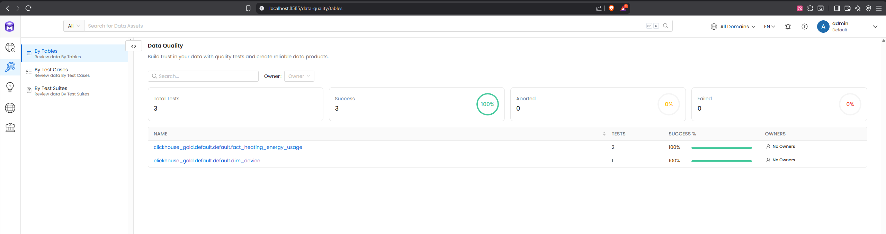
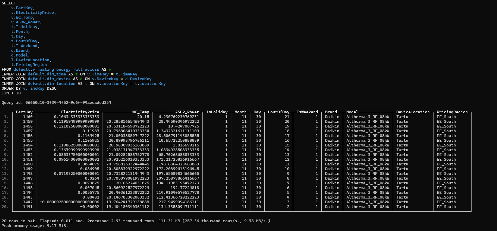
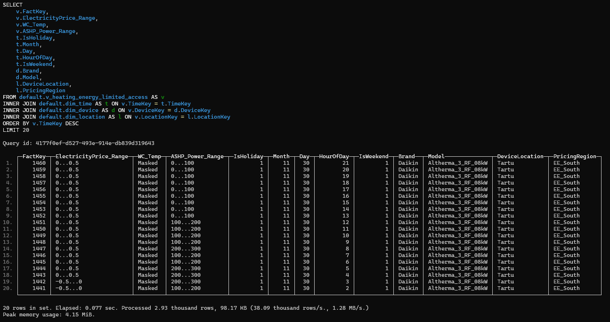
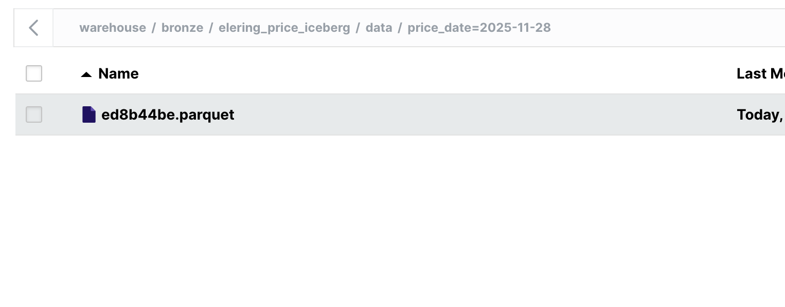
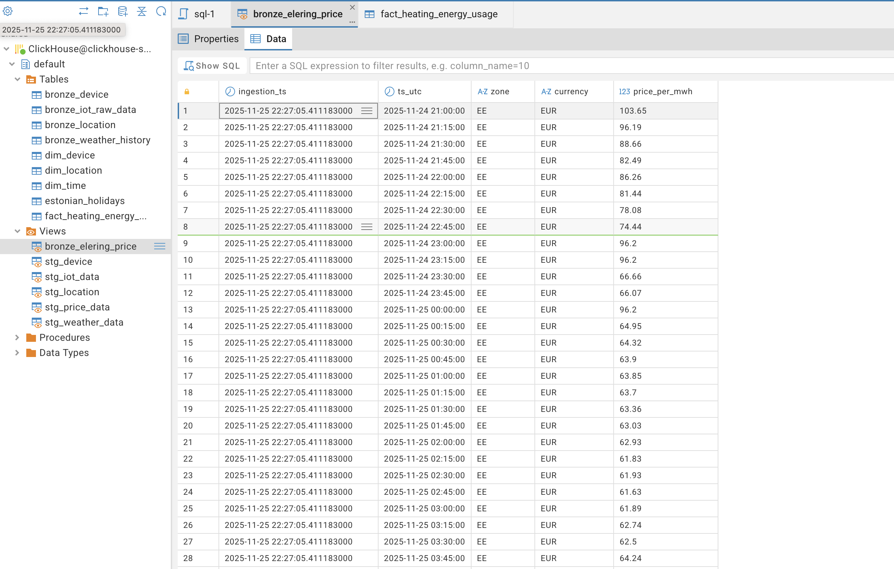
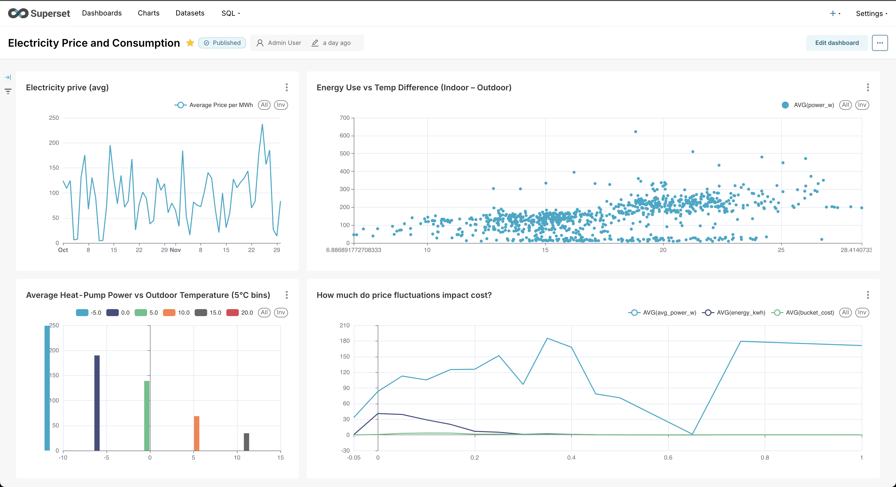
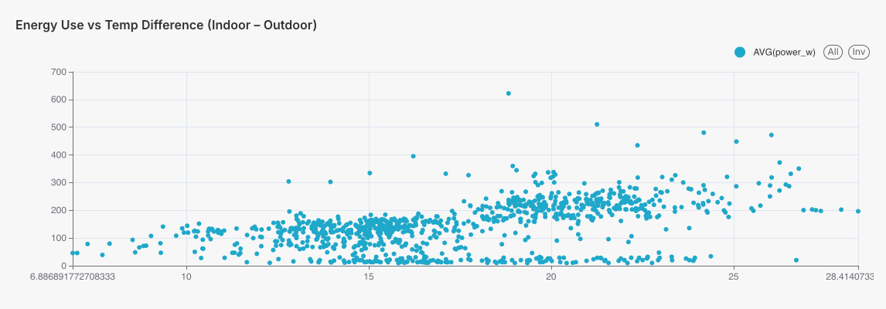

# 📊 Part 3 — Data Governance & Visualization

This part of the project focuses on implementing data governance and visualization using:

- **Apache Iceberg**
- **ClickHouse**
- **OpenMetadata**
- **Apache Superset**

---

## 🚀 Project Overview

For Project 3 we added minio as the object storage for the data that is queried through API's. 
Data pipeline in a simplified form:

1. Elering Price API
2. Minio with Iceberg to ensure rollbacks & consistent reads across snapshots
3. Clickhouse as the main database
4. Apache Superset to visualise data

All data is still automated via Apache Airflow and DBT.

---

## 🛠️ Setup & Installation

1. **Install [Tailscale](https://tailscale.com/)**: Sign in to Tailscale with the Google account or invite link provided by the team.
2. **Obtain secrets**: Get the shared `.env.local` file from the team. Place it alongside `docker-compose.yml` inside `02_Airflow_ClickHouse_dbt/` before starting any containers.
The file can be found from [Google Drive](https://drive.google.com/file/d/1_C8yHceYJq4tOPXwc69b1QlV-fdz3qt6/view?usp=sharing) and is directly available to course lectors. The peer graders and other interested parties must request access and **provide well explained reason** to obtain the access.
3. **Clone or update the project**:
  - Fresh setup: `git clone https://github.com/LauriLopp/DE_project_2025.git`
  - Existing clone: `git pull` to fetch the latest changes.
4. **Change directory**: `cd DE_project_2025/02_Airflow_ClickHouse_dbt`
5. **Start the stack**: `docker compose up --build -d`
6. **Access Airflow**: open `http://localhost:8080`, log in with username `airflow` and password `airflow`.
7. **Enable Main DAG**: turn on the `continuous_ingestion_pipeline` DAG and confirm the tasks progress to running state.
8. **Enable Historical DAG**: turn on the `backfill_historical_data` DAG and confirm the tasks progress to running state.
9  **Verify Metadata**: Open http://localhost:8585/ and log in with credentials: admin@open-metadata.org/admin   
10. **Verify that data is in Minio (Object Storage)**: Open `http://localhost:9001/login` , log in with credentials minioadmin/minioadmin
11. **Access Apache Superset UI**: open `http://localhost:8088`, login with credentials: admin/admin
12. **Verify data**: Navigate to dashboard for data visualisations. See screenshots in Example Queries & Dashboards

---

## 📁 Project Structure

```
03_Iceberg_OpenMetadata_Superset/
├── .env.local                          # (User-provided) Contains secret tokens and credentials
├── clickhouse-init/                    # Scripts to initialize ClickHouse on first run
│   ├── 01_roles.sql                    # Role definitions for ClickHouse access control
│   ├── 02_users.sql                    # User creation scripts with role assignments
│   └── 04_grants.sql                   # Grant statements for database permissions
├── cloudbeaver-init/                   # Pre-configured connection settings for CloudBeaver UI
│   ├── .dbeaver/
│   │   └── data-sources.json           # CloudBeaver data source configuration
│   └── initial-data-sources.json       # Initial connection settings template
├── config/                             # ClickHouse user and profile configurations
│   └── users.d/
│       ├── default-user.xml            # Default user configuration
│       └── temp_admin.xml              # Temporary admin user configuration
├── dags/
│   ├── backfill_historical_data.py     # DAG for backfilling historical Iceberg data
│   └── home_assistant_continuous_raw.py # Main Airflow DAG with OpenMetadata sync
├── data/                               # Mounted volume for data exchange
├── dbt/
│   ├── dbt_packages/                   # (Generated) Installed dbt packages
│   ├── macros/
│   │   └── expression_is_true_clickhouse.sql # Custom generic test for ClickHouse
│   ├── models/
│   │   ├── marts/                      # Gold layer: Dimensional and fact models
│   │   │   ├── dim_device.sql
│   │   │   ├── dim_location.sql
│   │   │   ├── dim_time.sql
│   │   │   ├── fact_heating_energy_usage.sql
│   │   │   └── schema.yml              # Tests and descriptions for mart layer
│   │   ├── staging/                    # Silver layer: Cleaned and standardized views
│   │   │   ├── stg_device.sql
│   │   │   ├── stg_iot_data.sql
│   │   │   ├── stg_location.sql
│   │   │   ├── stg_price_data.sql
│   │   │   └── stg_weather_data.sql
│   │   ├── views/                      # Access-controlled views for role-based access
│   │   │   ├── schema.yml              # Tests and descriptions for views
│   │   │   ├── v_heating_energy_full_access.sql
│   │   │   └── v_heating_energy_limited_access.sql
│   │   └── sources.yml                 # Defines Bronze layer sources for dbt
│   ├── seeds/
│   │   └── estonian_holidays.csv       # Seed data for public holidays
│   ├── .user.yml                       # (Generated) dbt user configuration
│   ├── dbt_project.yml                 # Main dbt project configuration file
│   ├── package-lock.yml                # Lockfile for dbt package versions
│   ├── packages.yml                    # External dbt package dependencies
│   ├── profiles.yml                    # Database connection profiles for dbt
│   └── selectors.yml                   # Definitions for selecting subsets of models
├── device_location_data/               # Static CSVs mounted into ClickHouse for seeding
│   ├── device_data.csv
│   └── location_data.csv
├── logs/                               # (Generated) Airflow task logs
├── openmetadata-init/                  # Automated OpenMetadata bootstrapping scripts
│   ├── bootstrap_openmetadata.py       # Creates ClickHouse service & ingestion pipeline
│   └── config.json                     # OpenMetadata service configuration template
├── superset/                           # Apache Superset configuration and assets
│   ├── dashboards/
│   │   └── superset_assets.zip         # Exported dashboard and chart definitions
│   ├── uploads/                        # Uploaded files for Superset
│   ├── fix_import_zip.py               # Script to fix dashboard import ZIP structure
│   └── superset_config.py              # Superset configuration (auto-import, ClickHouse)
├── docker-compose.yml                  # Defines all services (Airflow, dbt, ClickHouse, Superset, OpenMetadata, Iceberg, MinIO)
├── Dockerfile                          # Docker build for standalone dbt service
├── Dockerfile.airflow                  # Docker build for Airflow services
├── Dockerfile.superset                 # Docker build for Superset with ClickHouse driver
├── README.md                           # Main documentation for Part 3
└── Star_schema_02.png                  # Star schema diagram
```

---

## 🗄️ Data Governance with Apache Iceberg & OpenMetadata

### Example of added table and column descriptions for fact table 

### Integrated three tests for data quality:

OpenMetaData tests



---

## 🏦 Roles and Query access in ClickHouse


### Roles are created here:
[Roles_and_Users_creation](https://github.com/LauriLopp/DE_project_2025/tree/main/03_Iceberg_OpenMetadata_Superset/clickhouse-init)

*Note: the access to views is granted in view definition config*

### Access views definition can be found here:

[Create_full_access_view](https://github.com/LauriLopp/DE_project_2025/blob/main/03_Iceberg_OpenMetadata_Superset/dbt/models/views/v_heating_energy_full_access.sql)

[Create_limited_access_view](https://github.com/LauriLopp/DE_project_2025/blob/main/03_Iceberg_OpenMetadata_Superset/dbt/models/views/v_heating_energy_limited_access.sql)

### For testing run these commands:
1. Enter clickhouse-server container:

`docker exec -it de_project2_clickhouse_server bash`

2. Login for full user:
`clickhouse-client --user=user_analyst_full --password=strong_password_full`

3. Run example queries with full analyst user:

```
SELECT
  v.FactKey,
  v.ElectricityPrice,
  v.WC_Temp,
  v.ASHP_Power,
  t.IsHoliday,
  t.Month,
  t.Day,
  t.HourOfDay,
  t.IsWeekend,
  d.Brand,
  d.Model,
  l.DeviceLocation,
  l.PricingRegion
FROM default.v_heating_energy_full_access v
JOIN default.dim_time t ON v.TimeKey = t.TimeKey
JOIN default.dim_device d ON v.DeviceKey = d.DeviceKey
JOIN default.dim_location l ON v.LocationKey = l.LocationKey
order by v.TimeKey desc
LIMIT 10;
```



```
SELECT * from fact_heatin_energy_usage limit 10;
```


4. Run queries with limited analyst user
```
SELECT
  v.FactKey,
  v.ElectricityPrice,
  v.WC_Temp,
  v.ASHP_Power,
  t.IsHoliday,
  t.Month,
  t.Day,
  t.HourOfDay,
  t.IsWeekend,
  d.Brand,
  d.Model,
  l.DeviceLocation,
  l.PricingRegion
FROM default.v_heating_energy_limited_access v
JOIN default.dim_time t ON v.TimeKey = t.TimeKey
JOIN default.dim_device d ON v.DeviceKey = d.DeviceKey
JOIN default.dim_location l ON v.LocationKey = l.LocationKey
order by v.TimeKey desc
LIMIT 10;
```


```
SELECT * from fact_heatin_energy_usage limit 10;
```


---

## 📈 Visualization with Apache Superset

For data visualisation, we connected Clickhouse to Apache Superset in the usual manner.
For visualising our API data, we created a single dashboard. 


---

## 🖼️ Screenshots & Visuals

Elering Price data in Minio


Bronze Elering Price in Clickhouse through Minio/Iceberg


Apache Superset Dashboard


---

## 📝 Example Queries & Dashboards

Dashboard & Chart descriptions

Electricity price line-chart


In October and November we experienced "minus-price-day", where the price was negative. See filtered data:


Average Heat-Pump Power vs Outdoor Temperature (5°C bins).
Answers Q1 and Q2 — “How much energy does the AC need at different outdoor temperatures?”


Energy Cost vs Electricity Price Bucket.
Answers Q3 — “How much do price fluctuations impact cost?”


Energy Use vs Temp Difference (Indoor – Outdoor).
Answers Q1 and Q5 — demonstrates heating physics (Temp Delta → Power usage).



---