# A0 POSTER CONTENT
## Predictive Control of Air-Source Heat Pump Using Environmental and Market Data

**Group:** [YOUR GROUP NUMBER]

---

## 1. BUSINESS CONTEXT 📊 --> JOONAS

### Problem Statement
Residential air-source heat pumps (ASHP) consume significant energy for heating, with costs varying based on outdoor temperature, indoor conditions, and fluctuating electricity market prices. Homeowners need data-driven insights to optimize heating efficiency and minimize operational costs.

### Key Performance Indicators
- **Average ASHP power consumption vs outdoor temperature** (watts per 5°C bin)
- **Energy cost per electricity price bucket** (EUR/kWh ranges)
- **Heating efficiency** (watts per °C temperature difference)
- **Peak vs off-peak energy consumption** patterns

### Datasets
- **IoT Sensors** (9 devices): ASHP power, boiler metrics, indoor/WC temperature & humidity
- **Weather Data**: Temperature, humidity, wind, pressure, cloud coverage, UV index
- **Market Data**: Hourly electricity prices from Elering API (EUR/MWh)
- **Reference Data**: Device specifications, locations, Estonian holidays

---

## 2. ARCHITECTURE & MODEL 🏗️ --> ANTI

### System Architecture Diagram

```mermaid
graph TB
    subgraph Sources["📡 DATA SOURCES"]
        HA[Home Assistant API<br/>IoT + Weather]
        EL[Elering API<br/>Electricity Prices]
        OM[Open-Meteo API<br/>Weather History]
    end
    
    subgraph Bronze["🥉 BRONZE LAYER - Raw Data"]
        BR1[ClickHouse<br/>bronze_iot_raw_data<br/>bronze_weather_history]
        BR2[MinIO + Iceberg<br/>Elering Price Parquet]
    end
    
    subgraph Transform["⚙️ TRANSFORMATION"]
        DBT[dbt Models<br/>Bronze → Silver → Gold]
    end
    
    subgraph Gold["🥇 GOLD LAYER - Star Schema"]
        FACT[fact_heating_energy_usage<br/>Hourly ASHP metrics]
        DIM1[dim_time<br/>Sparse temporal]
        DIM2[dim_device<br/>ASHP specs]
        DIM3[dim_location<br/>Geography]
    end
    
    subgraph Consume["📈 CONSUMPTION"]
        OM_META[OpenMetadata<br/>Governance & Quality]
        SUP[Apache Superset<br/>Dashboards]
    end
    
    subgraph Orchestration["🎭 ORCHESTRATION"]
        AIR[Apache Airflow<br/>2 DAGs - Hourly + Backfill]
    end
    
    HA --> BR1
    EL --> BR2
    OM --> BR1
    
    BR1 --> DBT
    BR2 --> DBT
    
    DBT --> FACT
    DBT --> DIM1
    DBT --> DIM2
    DBT --> DIM3
    
    FACT --> OM_META
    FACT --> SUP
    DIM1 --> FACT
    DIM2 --> FACT
    DIM3 --> FACT
    
    AIR -.Orchestrates.-> HA
    AIR -.Orchestrates.-> EL
    AIR -.Orchestrates.-> DBT
    AIR -.Orchestrates.-> OM_META
    
    style FACT fill:#ffd700
    style AIR fill:#e6f3ff
    style DBT fill:#90EE90
```



### Star Schema Design


### Key Design Choices
- **Fact Table Grain**: One row per hour, per device, per location
- **SCD Type 2**: Device and location dimensions support historical tracking
- **Sparse Time Dimension**: Only hours with actual data (storage optimization)
- **Fact Table**: `fact_heating_energy_usage` with 20+ measures (power, temperature, weather, price)
- **3 Dimension Tables**: `dim_time` (temporal), `dim_device` (ASHP specs), `dim_location` (geography)

---

## 3. PIPELINES & TOOLS 🔄

### Data Flow Pipeline

```mermaid
flowchart LR
    subgraph Ingestion["1️⃣ INGESTION (Hourly)"]
        API1[Home Assistant<br/>API Call] --> B1[Bronze<br/>iot_raw_data]
        API2[Elering<br/>API Call] --> B2[MinIO Iceberg<br/>Parquet]
        API3[Weather<br/>API Call] --> B3[Bronze<br/>weather_history]
    end
    
    subgraph Silver["2️⃣ SILVER (Staging)"]
        B1 --> S1[stg_iot_data<br/>9 sensors → hourly avg]
        B3 --> S2[stg_weather_data<br/>Unit conversions]
        B2 --> S3[stg_price_data<br/>EUR/MWh → EUR/kWh]
    end
    
    subgraph Gold["3️⃣ GOLD (Marts)"]
        S1 --> G1[dim_time<br/>Sparse hours]
        S2 --> G1
        S3 --> G1
        
        S1 --> G2[fact_heating<br/>JOIN all sources]
        S2 --> G2
        S3 --> G2
        
        G2 --> V1[v_full_access<br/>analyst_full]
        G2 --> V2[v_limited_access<br/>analyst_limited<br/>MASKED]
    end
    
    subgraph Quality["4️⃣ QUALITY"]
        G2 --> T1[dbt tests<br/>20+ checks]
        G2 --> T2[OpenMetadata<br/>Test suites]
    end
    
    style B1 fill:#FFE4B5
    style B2 fill:#FFE4B5
    style B3 fill:#FFE4B5
    style S1 fill:#E0E0E0
    style S2 fill:#E0E0E0
    style S3 fill:#E0E0E0
    style G2 fill:#FFD700
    style V2 fill:#FF6B6B
```



### Transformation Example: Raw → Gold

**BRONZE (Raw JSON from API):**
```json
{
  "entity_id": "sensor.ohksoojus_power",
  "state": "1250.5",
  "last_changed": "2025-11-30T14:00:00Z"
}
```

**SILVER (Hourly aggregation + timezone conversion):**
```sql
SELECT 
  toStartOfHour(toTimeZone(last_changed, 'Europe/Tallinn')) AS hour_start,
  avgIf(toFloat64(state), entity_id = 'sensor.ohksoojus_power') AS heat_pump_power_avg,
  avgIf(toFloat64(state), entity_id = 'sensor.temp_indoor') AS indoor_temp_avg
FROM bronze_iot_raw_data
GROUP BY hour_start
```

**GOLD (Star schema fact table with dimensions):**
```sql
SELECT
  generateUUIDv4() AS FactKey,
  t.TimeKey, d.DeviceKey, l.LocationKey,
  i.heat_pump_power_avg AS ASHP_Power,
  i.indoor_temp_avg AS IndoorTemp,
  w.outdoor_temp_avg AS OutdoorTemp,
  p.price_eur_per_kwh AS ElectricityPrice
FROM stg_iot_data i
JOIN stg_weather_data w ON i.hour_start = w.hour_start
JOIN stg_price_data p ON i.hour_start = p.hour_start
CROSS JOIN dim_device d
CROSS JOIN dim_location l
JOIN dim_time t ON i.hour_start = t.FullDate
WHERE toDate(i.hour_start) BETWEEN d.InstallationDate AND d.ValidTo
```

### Technical Stack
- 🎭 **Orchestration**: Apache Airflow (LocalExecutor, 2 DAGs - hourly + backfill)
- ⚙️ **Transformation**: dbt (15+ models, 20+ tests, ClickHouse adapter)
- 💾 **Database**: ClickHouse (OLAP, columnar storage)
- 🪣 **Object Storage**: MinIO + Apache Iceberg (versioned tables, time travel)
- 🛡️ **Governance**: OpenMetadata (metadata catalog, lineage, quality tests)
- 📊 **Visualization**: Apache Superset (4 dashboards, ClickHouse connector)
- 🐳 **Infrastructure**: Docker Compose (11 services, named volumes)

### Orchestration Details
- **DAG 1**: `continuous_ingestion_pipeline` - Runs hourly, ingests latest data
- **DAG 2**: `backfill_historical_data` - One-time backfill (Oct 1, 2025 → present)
- **Idempotency**: DELETE-then-INSERT pattern ensures safe re-runs
- **Dependencies**: Bronze → dbt → OpenMetadata sync (sequential execution)

---

## 4. GOVERNANCE & QUALITY 🛡️

### Role-Based Access Control

**Implemented Roles:**

| Role | User | Access | Data Masking |
|------|------|--------|--------------|
| `analyst_full` | user_analyst_full | ✅ Full fact table<br/>✅ All dimensions<br/>✅ Price data | ❌ None |
| `analyst_limited` | user_analyst_limited | ✅ Pseudonymized view<br/>✅ All dimensions<br/>✅ Price data | ✅ ASHP_Power (100W buckets)<br/>✅ ElectricityPrice (0.5€ buckets)<br/>✅ WC_Temp (fully masked) |

**Grant Implementation:**
```sql
-- Both roles: Read dimensions + Iceberg price view
GRANT SELECT ON dim_device, dim_location, dim_time, 
     bronze_elering_iceberg_readonly TO analyst_full, analyst_limited;

-- Full role: Access full fact view
GRANT SELECT ON v_heating_energy_full_access TO analyst_full;

-- Limited role: NO direct fact table access, only pseudonymized view
GRANT SELECT ON v_heating_energy_limited_access TO analyst_limited;
```

### Data Masking Implementation

```sql
-- Limited access view (v_heating_energy_limited_access)
SELECT
  -- Original: ASHP_Power = 1,234 W
  concat(
    toString(floor(ASHP_Power / 100) * 100),
    '...',
    toString((floor(ASHP_Power / 100) * 100) + 100)
  ) AS ASHP_Power_Range,  -- Output: "1200...1300"
  
  -- Original: ElectricityPrice = 0.127 EUR/kWh
  concat(
    toString(floor(ElectricityPrice * 2) / 2),
    '...',
    toString((floor(ElectricityPrice * 2) / 2) + 0.5)
  ) AS ElectricityPrice_Range,  -- Output: "0.0...0.5"
  
  'Masked' AS WC_Temp  -- Fully hidden for privacy
FROM fact_heating_energy_usage
```

### Data Quality Checks

**dbt Tests Implemented (20+ checks):**

| Category | Count | Examples |
|----------|-------|----------|
| **Uniqueness** | 4 tests | `FactKey` unique in fact table<br/>`TimeKey` unique in dim_time |
| **Not Null** | 7 tests | All foreign keys required<br/>All primary keys required |
| **Referential Integrity** | 3 tests | `fact.TimeKey` → `dim_time.TimeKey`<br/>`fact.DeviceKey` → `dim_device.DeviceKey` |
| **Range Validation** | 10+ tests | `ASHP_Power >= 0`<br/>`Humidity BETWEEN 0 AND 100`<br/>`AirPressure BETWEEN 600-800 mmHg`<br/>`Month BETWEEN 1 AND 12` |
| **Enum Validation** | 1 test | `Season IN ('Winter','Spring','Summer','Autumn')` |

**Custom ClickHouse Test Macro:**
```sql
-- expression_is_true_clickhouse.sql

  SELECT * FROM {{ model }}
  WHERE NOT ({{ expression }})

```

### OpenMetadata Integration


**OpenMetadata Features Implemented:**
- ✅ **Auto-discovery**: ClickHouse service connection bootstrapped on startup via Python script
- ✅ **Documentation**: 24+ columns with business descriptions in all gold tables
- ✅ **Lineage**: Tracks data flow from Bronze → Silver → Gold layers
- ✅ **Test Suites**: 3 critical tests (TimeKey Not Null, DeviceKey Unique, Power Valid Range)
- ✅ **Scheduling**: Daily metadata refresh via Airflow task `trigger_openmetadata_ingestion`
- ✅ **Data Profiling**: Sample data preview, column statistics, null counts

---

## 5. OUTCOME & LESSONS 🎯--> Joonas

### Insights Delivered

**Apache Superset Dashboard (4 Visualizations):**

1. **⚡ Electricity Price Trends (Line Chart)**
   - **Discovery**: October/November 2025 had **negative pricing days** (surplus renewable energy)
   - **Impact**: Identified optimal times for pre-heating (when grid pays you to consume)
   - **Action**: Schedule high-power tasks during negative price windows

2. **🌡️ ASHP Power vs Outdoor Temperature (Bar Chart, 5°C bins)**
   - **Finding**: Linear relationship → every 5°C drop requires ~300W additional power
   - **Formula**: `Power ≈ 87 watts/°C × (Indoor - Outdoor)`
   - **Use Case**: Predict heating costs for upcoming cold fronts

3. **💰 Energy Cost by Price Bucket (Bar Chart)**
   - **Result**: 3 distinct price tiers identified in first 31 hours
   - **Cost Distribution**: 50% of costs in highest price bucket (peak hours)
   - **Optimization**: Shift 20% of consumption to off-peak = **10% cost savings**

4. **📐 Energy Use vs Temperature Delta (Scatter Plot)**
   - **Physics Validation**: ΔT drives power consumption (heating law confirmed)
   - **Efficiency Metric**: ~87 watts/°C at 20-23°C indoor setpoint
   - **Savings**: Lowering setpoint 1°C = 87W × 24h = **2.1 kWh/day saved**

### Business Questions Answered

| Question | SQL Metric | Result |
|----------|-----------|--------|
| **What's the optimal indoor temperature?** | `SUM(ASHP_Power) / SUM(IndoorTemp - OutdoorTemp)` | **87 watts/°C** at 20-23°C setpoint |
| **How much do price fluctuations impact cost?** | `SUM((ASHP_Power/1000) * ElectricityPrice) GROUP BY price_bucket` | 3 tiers, **50% cost in top tier** |
| **Peak vs off-peak usage patterns?** | `GROUP BY IsWeekend, IsPeakHour` | Initial 23 hours all off-peak weekend |

### Key Lessons Learned

* Most of the problems we had were either from:
    - not compatible versions
    - "shared-brain" issues where packages were in one place and needed to be used in another
    - all the data and metadata in volumes will be lost, can't rely on them
    - Win and Mac systems are uncomfortably different
    - Docker-init fails silently that makes debugging much more difficult
    - "an easy task" == >5h hour of work

### Future Enhancements

1. **📅 Longer Data Collection**: Need 3+ months to capture:
   - Full seasonal patterns (-25°C to +30°C range)
   - Complete price volatility (winter peak vs summer surplus)
   - Holiday vs weekday consumption differences

2. **🤖 Predictive Modeling**: Train ML model to:
   - Forecast optimal heating schedules (24h ahead)
   - Predict daily energy costs based on weather forecasts
   - Automate pre-heating during negative price windows

3. **🏠 Multi-Device Expansion**: 
   - Add 5+ homes for comparative analysis
   - Identify best-performing ASHP brands/models
   - Create benchmarking dashboard (your home vs average)

---

## APPENDIX: Visual Elements for Poster

### Images to Include from `visuals/` Folder

**Dashboard Screenshots:**
1. `dashboard_with_data.png` - Overview dashboard (main visual)
2. `Electricity_price.jpg` - Price trends chart
3. `Electricity Price 0 in Oct-Nov.jpg` - Negative price discovery (highlight!)
4. `average-heat-pump-power-vs-outdoor-temperature-5-c-bins.jpg`
5. `how-much-do-price-fluctuations-impact-cost.jpg`
6. `energy-use-vs-temp-difference-indoor-outdoor.jpg`

**Governance Screenshots:**
7. `metadata_cols.png` - OpenMetadata column descriptions
8. `openmetadata_tests.png` - Quality test results
9. `working_full_query.png` - Full access role demo
10. `working_limited_query.png` - Limited access role demo (with masking)

**Additional Visuals Needed:**
- Airflow DAG graph view (both DAGs side-by-side)
- dbt lineage graph from `dbt docs generate`
- MinIO bucket showing Parquet files structure
- ClickHouse table list or query results

---

## Suggested A0 Portrait Layout

```
┌─────────────────────────────────────────────────────────┐
│  TITLE: Predictive Control of Air-Source Heat Pump     │
│  Subtitle: Environmental and Market Data Integration   │
│  Group: [NUMBER] | Authors: [NAMES] | Date: Dec 2025   │
├─────────────────────────────────────────────────────────┤
│  1. BUSINESS CONTEXT (15% height)                       │
│  ┌───────────┬───────────┬───────────┐                 │
│  │ Problem   │ KPIs      │ Datasets  │                 │
│  │ 2-3 sent. │ 4 bullets │ 4 sources │                 │
│  └───────────┴───────────┴───────────┘                 │
├──────────────────────┬──────────────────────────────────┤
│  2. ARCHITECTURE     │  2. STAR SCHEMA                 │
│  (25% height)        │  (25% height)                   │
│  ┌────────────────┐  │  ┌──────────────────┐           │
│  │ System Flow    │  │  │ ERD Diagram      │           │
│  │ Mermaid Graph  │  │  │ Fact + 3 Dims    │           │
│  │ (7 components) │  │  │ Grain Callout    │           │
│  └────────────────┘  │  └──────────────────┘           │
├──────────────────────┴──────────────────────────────────┤
│  3. PIPELINES & TOOLS (25% height)                      │
│  ┌──────────────────────────────────────────────────┐   │
│  │ Data Flow: Bronze → Silver → Gold (Mermaid)     │   │
│  └──────────────────────────────────────────────────┘   │
│  ┌──────────────┬──────────────┬──────────────┐        │
│  │ Raw JSON     │ SQL Silver   │ SQL Gold     │        │
│  │ (3 lines)    │ (6 lines)    │ (8 lines)    │        │
│  └──────────────┴──────────────┴──────────────┘        │
│  Tech Stack: [7 icons with labels]                     │
├─────────────────────────────────────────────────────────┤
│  4. GOVERNANCE & QUALITY (15% height)                   │
│  ┌─────────────────┬─────────────────┬───────────────┐ │
│  │ Role Table      │ Masking Code    │ OM Screenshot │ │
│  │ (2 roles)       │ (SQL example)   │ (test results)│ │
│  └─────────────────┴─────────────────┴───────────────┘ │
├─────────────────────────────────────────────────────────┤
│  5. OUTCOME & LESSONS (20% height)                      │
│  ┌──────────┬──────────┐  ┌────────────────────────┐   │
│  │ Chart 1  │ Chart 2  │  │ 3 Lessons Learned:     │   │
│  ├──────────┼──────────┤  │ 1. Timezone (3 lines)  │   │
│  │ Chart 3  │ Chart 4  │  │ 2. Idempotent (3 lines)│   │
│  └──────────┴──────────┘  │ 3. Iceberg (3 lines)   │   │
│                            └────────────────────────┘   │
│  Business Impact: [Key metrics table]                   │
└─────────────────────────────────────────────────────────┘
```

---

## Repository & Contact

**GitHub Repository**: https://github.com/LauriLopp/DE_project_2025

QR code for link to our project repo:


**Project Path**: `03_Iceberg_OpenMetadata_Superset/`

**Documentation**: See `README.md` for setup instructions and detailed architecture

**Technologies**: Apache Airflow • dbt • ClickHouse • Apache Iceberg • MinIO • OpenMetadata • Apache Superset • Docker

---

**END OF POSTER CONTENT**
